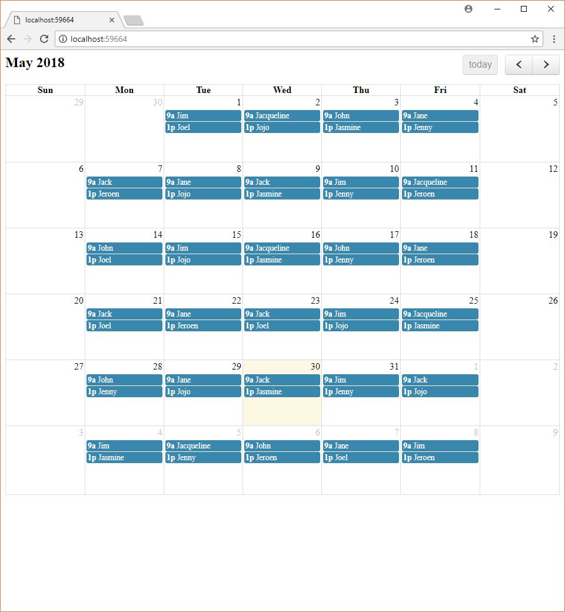

# SupportWheelOfFate
Random work schedule generator for 10 employees and 2 daily shifts, weekends excluded

## Approach

The chosen high-level strategy is to generate monthly schedules in advance, since that's normally helpful when it comes to planning and such things.

Background jobs have been configured to take care of generating schedules for the current month - if they're not already in place, as well as for the coming month - if the current date is the 23rd or later.

The generated schedules should, of course, be manually editable, as long as they obey the business rules, although this is not currently implemented.

There are two approaches that have been considered, each of which is given a brief overview below.

*NOTE that the 2nd approach isn't used - nor is it fully implemented - at this time*

#### First Approach

Given that we have 10 employees and 2 daily (half-)shifts, we can cover weekly schedules by having each employee work only one shift per week.

This is probably desirable, since it minimizes the stress on the individual and maximizes diversity.

A simple approach is to generate random permutations of employees and then zip them with the daily shifts. Example for one workday and two employees:

`[John, Jane]`
x
`[Wed Morning, Wed Afternoon]`
=>
`[{John, Wed Morning}, {Jane, Wed Afternoon}]`

Of course, validations of the business rules need to occur when adding new weekly schedules, considering the previous one/s.

*NOTE that the above validations aren't implemented in the current version*

* `Pros`: simplicity, ease of implementation
* `Cons`: not very flexible with business rules change

#### Second Approach

Another, more complex approach, is to generate valid work patterns for the desired period and then assign them to people, making sure the whole timetable is covered.

Example for a 2-day period, 2 shifts, 4 employees:

`patterns:`

`[{0, 1}, {1, 0}]`
x
`[Mon, Tue]`
x
`[Morning, Afternoon]`
=>
`[[0, {Tue, Morning}], [0, {Tue, Afternoon}], [{Mon, Morning}, 0], [{Mon, Afternoon}, 0]]`

`schedules:`

`patterns`
x
`[John, Jane, Jim, Jack]`
=>
`[{John, Tue, Morning}, {Jane, Tue, Afternoon}, {Jim, Mon, Morning}, {Jack, Mon, Afternoon}]`

This example maximizes diversity while minimizing stress on the individual, to keep in line with the one in the first approach. It is, however, easy to see how flexibility can be achieved by just varying the day on/off patterns.

Another remark here is that shorther patterns (e.g. 5-day) can be generated and then concatenated into longer ones (e.g. 10-day): `{0, 0, 0, 1, 0}` `o` `{1, 0, 0, 0, 0}` => `{0, 0, 0, 1, 0, 1, 0, 0, 0, 0}`.

* `Pros`: flexibility
* `Cons`: more difficult to implement

## Setup
* Clone the repository
* `cd` into `SupportWheelOfFate.API` and restore the database:

`dotnet ef database update`

Running the above command should produce an output similar to the one below:

```
Applying migration '20180527152328_Initial'.
Done.
```

## Test the app in Debug mode

* Open the solution in VisualStudio 2017
* Launch the `SupportWheelOfFate.API` project
* Wait for the schedules to be generated **
* Launch the `SupportWheelOfFate.Web` project ***

** This is done from background jobs that get invoked shortly after the API project has been launched

To get feedback on the background schedule generation process, select `Show output from: ASP.NET Core Web Server` in the Output window in VS, once the project has been launched in Debug mode.

During the first run, the output should be similar to the one below:

```
SupportWheelOfFate.API> GetSchedulesBetween 5/1/2018 12:00:00 AM and 5/2/2018 12:00:00 AM: 0 found
SupportWheelOfFate.API> New schedule added to DB. New total: 1
SupportWheelOfFate.API> New schedule added to DB. New total: 2
[...]
SupportWheelOfFate.API> New schedule added to DB. New total: 43
SupportWheelOfFate.API> New schedule added to DB. New total: 44
SupportWheelOfFate.API> New schedule added to DB. New total: 45
SupportWheelOfFate.API> New schedule added to DB. New total: 46
SupportWheelOfFate.API> Generated schedules for current month
```

```
SupportWheelOfFate.API> GetSchedulesBetween 6/1/2018 12:00:00 AM and 6/2/2018 12:00:00 AM: 0 found
SupportWheelOfFate.API> New schedule added to DB. New total: 47
SupportWheelOfFate.API> New schedule added to DB. New total: 48
[...]

SupportWheelOfFate.API> New schedule added to DB. New total: 86
SupportWheelOfFate.API> New schedule added to DB. New total: 86
SupportWheelOfFate.API> New schedule added to DB. New total: 87
SupportWheelOfFate.API> New schedule added to DB. New total: 88
SupportWheelOfFate.API> Generated schedules for next month
```

On subsequent runs, the background jobs should detect the existing schedules and skip the generation of new ones:

```
SupportWheelOfFate.API> GetSchedulesBetween 5/1/2018 12:00:00 AM and 5/2/2018 12:00:00 AM: 2 found
SupportWheelOfFate.API> Schedules for current month already in place
SupportWheelOfFate.API> GetSchedulesBetween 6/1/2018 12:00:00 AM and 6/2/2018 12:00:00 AM: 2 found
SupportWheelOfFate.API> Schedules for next month already in place
```

*** Doing so should cause a simple calendar to be loaded in the browser, displaying the schedules for the current month, e.g.:



## Solution structure

There are three projects making up the current solution:

* SupportWheelOfFate.Web
* SupportWheelOfFate.API
* SupportWheelOfFate.Core

#### SupportWheelOfFate.Web

This is the web frontend and it only consists of an HTML document leveraging the popular `FullCalendar` JS library.

The actual data that gets fed into the calendar is, of course, fetched from the API, which is described below.

#### SupportWheelOfFate.API

Simple `WebApi` project exposing an endpoint that returns the schedules for a +/-45 day interval centered on the current date:

```GET /api/schedules```

The data is returned as an array of JSON objects resembling the following:

```
{"startTime":"2018-05-01T09:00:00","endTime":"2018-05-01T13:00:00","employee":"Jim"}
```

This is also where other concerns such as persistence (`SQLite`) and background jobs (`Hangfire`) are addressed.

#### SupportWheelOfFate.Core

This is where the schedule generation logic resides.
